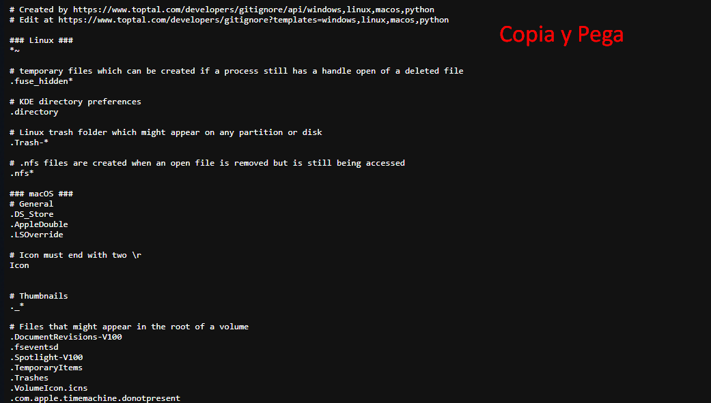

## ⚫ Instalación y Configuración de Git en Ubuntu (WSL)

### 1. Generar git ignore

Ingresa a [gitignore.io](https://www.toptal.com/developers/gitignore/) y en la barra de busqueda escribiremos el sistema operativo y el lenguaje en este caso python

Copia todo el archivo depura lo que veas necesario depurar:

Luego pega el gitignore generado en un archivo llamado ".gitignore"

