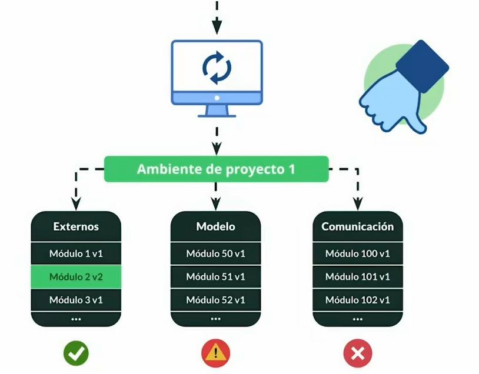
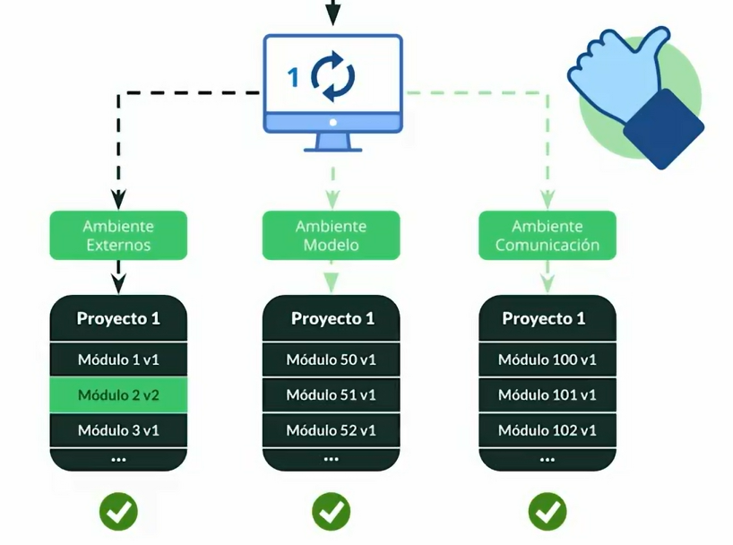
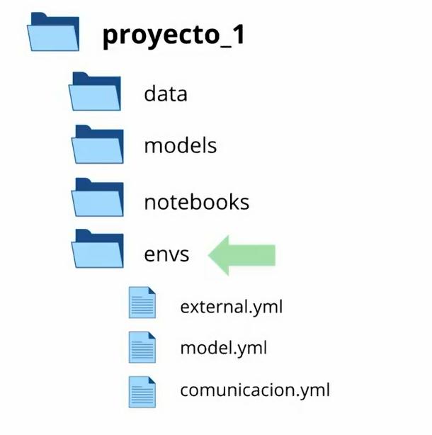

## 🔷 Entornos virtuales

`Conda` es una herramienta esencial para la gestión de paquetes y entornos, que facilita el trabajo con diversos lenguajes de programación como Python y R.

## ¿Cómo instalar Conda?

Instalar Conda se puede hacer de dos maneras principales: a través de MiniConda o Anaconda.

- MiniConda: Ofrece una instalación mínima, proveyendo solo lo necesario para que Conda funcione, incluyendo Python.

- Anaconda: Es una instalación más completa que incluye MiniConda y una multitud de paquetes y herramientas útiles para la ciencia de datos.

---

### 1. Instalar Anaconda

- Ingresa a la página oficial de [Ananconda](https://www.anaconda.com/download/success)
- Dirigete a descargas, sección linux y copia la url para descargar. Una vez copiada la url te aconsejamos que pegues esta liga en el buscador verifica que contenga la siguiente estructura: https://repo.anaconda.com/archive/Anaconda3-2025.12-2-Linux-x86_64.sh

**Puede que esta liga este desactualizada por lo que te recomendas ingresar y validar**

- Una vez copiada la liga ingresa a tu terminal y ejecuta:

Actualizar paquetes en tu versión de linux

```bash
sudo apt update
```

Descargar el instalador, asegurate de estar en la carpeta donde quieres que se descargue este instaldor.

```bash
wget -O anaconda.sh https://repo.anaconda.com/archive/Anaconda3-2025.12-2-Linux-x86_64.sh
```

Verifica que se haya descagardo el instalador

```bash
ls -al
```

Ejecutar el instalador

```bash
bash anaconda.sh
```

Una vez ejecutes el instalador sigue las instrucciones en la terminal.

**Recomendación**: Ejecuta la inicialización de anaconda, finalizar la instalación la terminal te preguntará si deseeas realizar esta acción digita "yes" para confirmar.

Luego de instalar anaconda abre una nueva terminal. Podrás observar de forma escrita en esa nueva terminal el etorno (base) esto confirmará que haz instalado anaconda con exito.

Si deseas conocer mayor detalle ejecuta,

```bash
conda info
```

Podrás ver el entorno virtual en el que estás (base, etc), la ubicación de anaconda entre otros detalles.

### 2. Ejecutar Jupyer NoteBook

Ejecutar el comando

```bash
jupyter-notebook
```

En wsl se mostrará diferentes enlaces, copia y pega el localhost en tu navegador para abrir un jupyer notebook, escoge nuevo notebook usando python http://localhost:8888/.....

Para salir ejecuta `CTRL + C`

### 3. Notebook en VSC

Abre visual estudio code, asegurate de estar en la carpeta de tu proyecto y ejecuta

```bash
code .
```

Luego crea un archivo con la extensión **.ipynb** ejemplo: `notebook.ipynb`. Ingresa al archivo, en la parte superior derecha verás la acción **Select Kernel** da click allí y luego selecciona el entorno base(Python #versión)

**Recomendación**: Si no ves el kernel pudes probar recargando con `CTRL + R` o solo es cuestión de cerrar tu visual y volver abrir, esto hará que refresque y detecte el nuevo entorno.

### 4. Entornos virtuales con conda

**Consultar entornos virtuales**

Visualiza tus entornos virtuales con

```bash
conda env list
```

**Crear entorno virtual**

Estructura conda create --name `[nombre-entorno] [paquetes]`

\*Flag `--name` se utliza para darle nombre al nuevo entorno virtual. Si no se específica la versión de los paquetes se instalará la más reciente

Para crear tus entornos virtuales ejecuta

```bash
conda create --name env python pandas
```

**Activar entorno virtual**

```bash
conda activate env
```

Visualiza la lista de tus paquetes de tu nuevo entorno virtual y sus respectivas versiones con

```bash
conda list
```

Visualiza un paquete específico de tu nuevo entorno virtual y sus respectiva versión con

```bash
conda list pandas
```

**Desactivar entorno virtual**

```bash
conda deactivate
```

**Actualizar paquetes de tu entorno virtual**

- Usando update

  Actualiza un paquete específico de tu nuevo entorno virtual

  \*Este comando actualizará a la versión más reciente

  ```bash
  conda update pandas
  ```

Usando install

Actualiza un paquete específico de tu nuevo entorno virtual, con este comando podrás específicar la versión que requieres

```bash
conda install python=3.9 pandas=1.2
```

**Copiar un entorno virtual**

Para clonar un entorno ejecuta

```bash
conda create --name py39 --copy --clone env
```

**Eliminar un paquete de un entorno virtual**

Para eliminar un paquete de un entorno ejecuta

```bash
conda remove pandas
```

**Eliminar un entorno virtual**

Para eliminar un entorno virtual ejecuta

\*Flag `--name` se utliza para especificar nombre del entorno a eliminar.

\*Solo puedes eliminar un entorno que no estés utilizando.

```bash
conda env remove --name env
```

### 5. Comandos conda para gestión de entornos virtuales

**Instalar un paquete que no se encuentra en los canales actuales**

Esto se utiliza cuando conda no encuentra un paquete

Ingresa a [Anaconda](https://anaconda.org/) y en la barra de busqueda escribiremos el paquete

Ejemplo:


```bash
conda install boltons
```

Una vez encontrado el paquete, ejecutaremos el siguiente comando manteniendo la estructura

Flag `--channel`, `nombre-canal` y `nombre-paquete`

```bash
conda install --channel conda-forget boltons
```

**Tracking de instalaciones**

Cada instalación genera un tracking lo cual permite llevar un control de cambios en el tienpo. Este tracking consta de diferentes revisiones.

Para listar las revisiones ejecuta

```bash
conda list --revision
```

Una vez obtengas el listado, fíjate en el índice generado por cada revision, mediante este indice podras regresar a cierto cambio realizado.

Para ello ejecuta el siguiente comando con la estructura

Flag `--revision` e indicar `indice`

```bash
conda install --revision 0
```

**Exportar un ambiente**

Para exportar un ambiente que se requiere compartir, asegurate de estar en ese ambiente y luego ejecuta el comando manteniendo la estructura

Flag `--from-history` para exportar las dependencias instaladas de forma manual

Flag `--file` para indicar que se generará un archivo, este flag debera anteceder el nombre del archivo junto con su extensión `.yml`

```bash
conda env export --from-history --file environment.yml
```

Con este comando Conda exportará los paquetes que se instalaron manualmente, es útil para implementar en diferentes sistemas operativos.

**Instalación del ambiente exportado**

Para instalar el ambiente exportado se debe desactivar cualquier ambiente activo, para ello ejecuta

```bash
conda deactivate
```

Asegurate, de estar en el ambiente base y guardar el archivo previamente exportado en la ruta ~/anaconda3/envs

Luego ejecuta el comando especificando el nombre del archivo y su extensión

```bash
conda env create --file environment.yml
```

### 6. Instalar Mamba

**Acelerar creación de ambientes con mamba**

Diseñada específicamente para optimizar la creación y gestión de ambientes virtuales, resolviendo dependencias de manera paralela y mejorando significativamente la velocidad.

Instalar mamba, para ello crea un nuevo entorno donde instalar mamba, de esa forma evitarás conflictos con el entorno base. Ejecuta

```bash
conda create -n entorno-mamba -c conda-forge mamba
conda activate entorno-mamba
```

**Comandos Mamba**

Para listar los comandos que maneja mamba. Ejecuta:

```bash
mamba --help
```

**Crear ambientes con mamba**

Para crear un ambiente con mamba de un entorno exportado en archivo .yml, ejecuta:

```bash
mamba env create --file nombre-archivo.yml
```

### 7. Gestionar entornos en proyectos

**¿Cómo aplicar el algoritmo de Divide y Vencerás en ambientes virtuales?**

El manejo de ambientes virtuales en proyectos grandes puede convertirse en un desafío titánico. Optar por el algoritmo de "Divide y Vencerás" puede ser la clave para gestionar estos ambientes de manera eficiente. Este enfoque permite dividir un problema complejo en partes más pequeñas y manejables. Aquí descubrirás cómo colocar esta estrategia en práctica al trabajar con ambientes virtuales, ahorrándote horas de posibles complicaciones.

**¿Qué es el algoritmo de Divide y Vencerás?**

El algoritmo de Divide y Vencerás se refiere a un método que resuelve problemas complejos descomponiéndolos en subproblemas más pequeños, fáciles de resolver por separado. Una vez solucionadas las partes individuales, se combinan para resolver el problema original. Aplicado a los ambientes virtuales, significa crear ambientes más pequeños y específicos dentro de un gran entorno de desarrollo.

**¿Por qué dividir un ambiente virtual?**

Los ambientes virtuales permiten mantener proyectos independientes y evitar que cambios en uno afecten negativamente a otros. Sin embargo, en un ambiente gigantesco con miles de dependencias, una simple actualización podría causar inestabilidad en el proyecto. Aquí es donde la división se vuelve crucial:



- Control granular: Ofrece un mayor control sobre el proyecto y sus dependencias.
- Estabilidad: Minimiza el riesgo de que actualizaciones generen conflictos en todo el sistema.
- Flexibilidad: Facilita la gestión de actualizaciones sin impactar otros módulos.

**¿Cómo implementar esta estrategia en Conda?**

Para aplicar esta técnica en Conda, sigue estos pasos clave:

- Estructura de archivos: Organiza tu proyecto en carpetas específicas (datos, modelos, notebooks).
- Divide ambientes: En lugar de un único archivo environment.yml, crea una nueva carpeta ambientes y subdivide en archivos específicos para cada necesidad (por ejemplo, external.yml, model.yml y communication.yml).

**Cómo funciona en la práctica**

El enfoque de Divide y Vencerás no significa que un notebook use simultáneamente varios ambientes, sino que el proyecto completo se organiza en módulos, y cada módulo se ejecuta en su propio ambiente cuando lo necesitas.

Un notebook = un kernel/ambiente.  
Cuando abres un notebook en VS Code, eliges el kernel correspondiente. Ese kernel está ligado a un ambiente virtual específico.

Varios ambientes = varios kernels disponibles.  
Si tu proyecto tiene tres ambientes (external.yml, model.yml, comunicacion.yml), entonces tendrás tres kernels distintos registrados. Cada notebook se abre con el kernel que corresponde a su propósito.



Divide y Vencerás aplicado:

El notebook de preprocesamiento de datos se ejecuta con el kernel del ambiente external.yml (que contiene librerías de scraping, requests, etc.).

El notebook de entrenamiento de modelos se ejecuta con el kernel del ambiente model.yml (que contiene TensorFlow, PyTorch, scikit-learn).

El notebook de comunicación o visualización se ejecuta con el kernel del ambiente comunicacion.yml (que contiene matplotlib, seaborn, librerías de reporting).

De esta manera, no mezclas dependencias pesadas en un solo ambiente gigante, sino que cada parte del proyecto tiene su propio entorno controlado.



**¿Qué herramienta complementa este enfoque?**

Una herramienta que complementa perfectamente este método es Snakemake. Es un motor de flujo de trabajo que permite definir etapas del proyecto en Python, ejecutándolas en ambientes especializados automáticamente. Por ejemplo, cada paso en tu flujo de trabajo podría gestionarse por diferente ambiente asegurando que cada etapa se mantenga limpia y funcional.

**¿Qué ventajas ofrece Snakemake?**

- Automatización: Gestiona automáticamente la ejecución de pasos en ambientes específicos.
- Estructuración de proyectos: Define tus etapas de colección, procesamiento de datos y creación de modelos de manera individual.
  Optimización de recursos: Evita dependencias innecesarias al ejecutar solo lo necesario en cada etapa.

**¿Cómo se conecta todo?**

Snakemake o Makefiles: permiten orquestar que cada etapa se ejecute en su ambiente correcto. Tú defines reglas: “para entrenar el modelo usa este ambiente”, “para graficar usa este otro”.

VS Code/Jupyter: simplemente seleccionas el kernel adecuado para cada notebook. No necesitas que un notebook cambie de kernel en medio de la ejecución; lo importante es que cada notebook esté vinculado al ambiente correcto

Este enfoque te permitirá actualizar sólo el ambiente de interés sin afectar el resto del proyecto.
