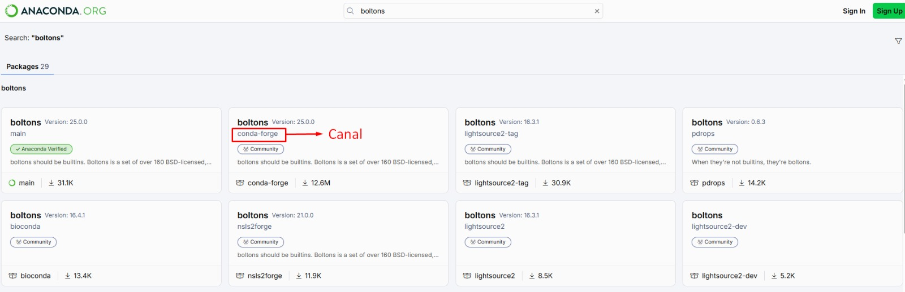
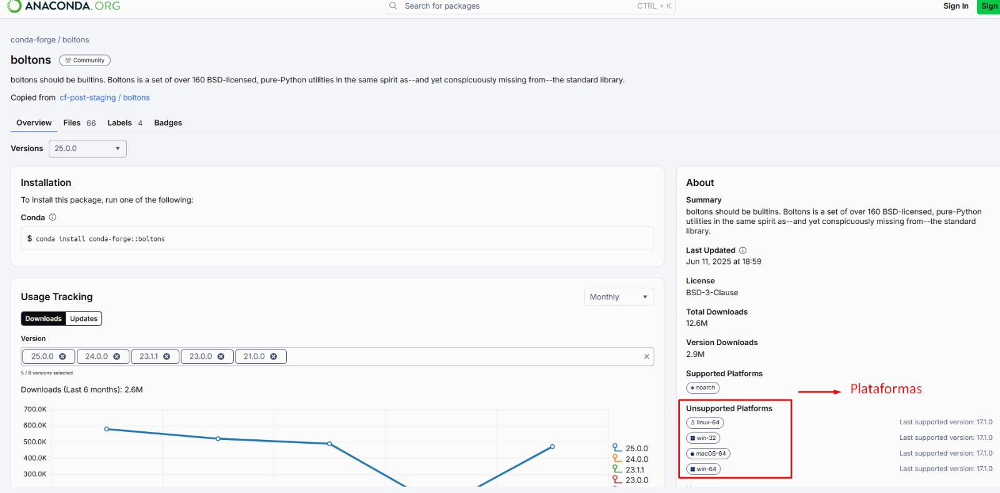

## 🔷 Entornos virtuales

`Conda` es una herramienta esencial para la gestión de paquetes y entornos, que facilita el trabajo con diversos lenguajes de programación como Python y R.

## ¿Cómo instalar Conda?

Instalar Conda se puede hacer de dos maneras principales: a través de MiniConda o Anaconda.

- MiniConda: Ofrece una instalación mínima, proveyendo solo lo necesario para que Conda funcione, incluyendo Python.

- Anaconda: Es una instalación más completa que incluye MiniConda y una multitud de paquetes y herramientas útiles para la ciencia de datos.

---

### 1. Instalar Anaconda

- Ingresa a la página oficial de [Ananconda](https://www.anaconda.com/download/success)
- Dirigete a descargas, sección linux y copia la url para descargar. Una vez copiada la url te aconsejamos que pegues esta liga en el buscador verifica que contenga la siguiente estructura: https://repo.anaconda.com/archive/Anaconda3-2025.12-2-Linux-x86_64.sh

**Puede que esta liga este desactualizada por lo que te recomendas ingresar y validar**

- Una vez copiada la liga ingresa a tu terminal y ejecuta:

Actualizar paquetes en tu versión de linux

```bash
sudo apt update
```

Descargar el instalador, asegurate de estar en la carpeta donde quieres que se descargue este instaldor.

```bash
wget -O anaconda.sh https://repo.anaconda.com/archive/Anaconda3-2025.12-2-Linux-x86_64.sh
```

Verifica que se haya descagardo el instalador

```bash
ls -al
```

Ejecutar el instalador

```bash
bash anaconda.sh
```

Una vez ejecutes el instalador sigue las instrucciones en la terminal.

**Recomendación**: Ejecuta la inicialización de anaconda, finalizar la instalación la terminal te preguntará si deseeas realizar esta acción digita "yes" para confirmar.

Luego de instalar anaconda abre una nueva terminal. Podrás observar de forma escrita en esa nueva terminal el etorno (base) esto confirmará que haz instalado anaconda con exito.

Si deseas conocer mayor detalle ejecuta,

```bash
conda info
```

Podrás ver el entorno virtual en el que estás (base, etc), la ubicación de anaconda entre otros detalles.

### 2. Ejecutar Jupyer NoteBook

Ejecutar el comando

```bash
jupyter-notebook
```

En wsl se mostrará diferentes enlaces, copia y pega el localhost en tu navegador para abrir un jupyer notebook, escoge nuevo notebook usando python http://localhost:8888/.....

Para salir ejecuta `CTRL + C`

### 3. Notebook en VSC

Abre visual estudio code, asegurate de estar en la carpeta de tu proyecto y ejecuta

```bash
code .
```

Luego crea un archivo con la extensión **.ipynb** ejemplo: `notebook.ipynb`. Ingresa al archivo, en la parte superior derecha verás la acción **Select Kernel** da click allí y luego selecciona el entorno base(Python #versión)

**Recomendación**: Si no ves el kernel pudes probar recargando con `CTRL + R` o solo es cuestión de cerrar tu visual y volver abrir, esto hará que refresque y detecte el nuevo entorno.

### 4. Entornos virtuales con conda

**Consultar entornos virtuales**

Visualiza tus entornos virtuales con

```bash
conda env list
```

**Crear entorno virtual**

Estructura conda create --name `[nombre-entorno] [paquetes]`

\*Flag `--name` se utliza para darle nombre al nuevo entorno virtual. Si no se específica la versión de los paquetes se instalará la más reciente

Para crear tus entornos virtuales ejecuta

```bash
conda create --name env python pandas
```

**Activar entorno virtual**

```bash
conda activate env
```

Visualiza la lista de tus paquetes de tu nuevo entorno virtual y sus respectivas versiones con

```bash
conda list
```

Visualiza un paquete específico de tu nuevo entorno virtual y sus respectiva versión con

```bash
conda list pandas
```

**Desactivar entorno virtual**

```bash
conda deactivate
```

**Actualizar paquetes de tu entorno virtual**

- Usando update

  Actualiza un paquete específico de tu nuevo entorno virtual

  \*Este comando actualizará a la versión más reciente

  ```bash
  conda update pandas
  ```

- Usando install

  Actualiza un paquete específico de tu nuevo entorno virtual, con este comando podrás específicar la versión que requieres

  ```bash
  conda install python=3.9 pandas=1.2
  ```

**Copiar un entorno virtual**

Para clonar un entorno ejecuta

```bash
conda create --name py39 --copy --clone env
```

**Eliminar un paquete de un entorno virtual**

Para eliminar un paquete de un entorno ejecuta

```bash
conda remove pandas
```

**Eliminar un entorno virtual**

Para eliminar un entorno virtual ejecuta

\*Flag `--name` se utliza para especificar nombre del entorno a eliminar.

\*Solo puedes eliminar un entorno que no estés utilizando.

```bash
conda env remove --name env
```

### 5. Comandos conda para gestión de entornos virtuales

**Instalar un paquete que no se encuentra en los canales actuales**

Esto se utiliza cuando conda no encuentra un paquete

Ingresa a [Anaconda](https://anaconda.org/) y en la barra de busqueda escribiremos el paquete

Ejemplo:





```bash
conda install boltons
```

Una vez encontrado el paquete, ejecutaremos el siguiente comando manteniendo la estructura

Flag `--channel`, `nombre-canal` y `nombre-paquete`

```bash
conda install --channel conda-forget boltons
```

**Tracking de instalaciones**

Cada instalación genera un tracking lo cual permite llevar un control de cambios en el tienpo. Este tracking consta de diferentes revisiones.

Para listar las revisiones ejecuta

```bash
conda list --revision
```

Una vez obtengas el listado, fíjate en el índice generado por cada revision, mediante este indice podras regresar a cierto cambio realizado.

Para ello ejecuta el siguiente comando con la estructura

Flag `--revision` e indicar `indice`

```bash
conda install --revision 0
```

**Exportar un ambiente**

Para exportar un ambiente que se requiere compartir, asegurate de estar en ese ambiente y luego ejecuta el comando manteniendo la estructura

Flag `--from-history` para exportar las dependencias instaladas de forma manual

Flag `--file` para indicar que se generará un archivo, este flag debera anteceder el nombre del archivo junto con su extensión `.yml`

```bash
conda env export --from-history --file environment.yml
```

Con este comando Conda exportará los paquetes que se instalaron manualmente, es útil para implementar en diferentes sistemas operativos.

**Instalación del ambiente exportado**

Para instalar el ambiente exportado se debe desactivar cualquier ambiente activo, para ello ejecuta

```bash
conda deactivate
```

Asegurate, de estar en el ambiente base y guardar el archivo previamente exportado en la ruta ~/anaconda3/envs

Luego ejecuta el comando especificando el nombre del archivo y su extensión

```bash
conda env create --file environment.yml
```
