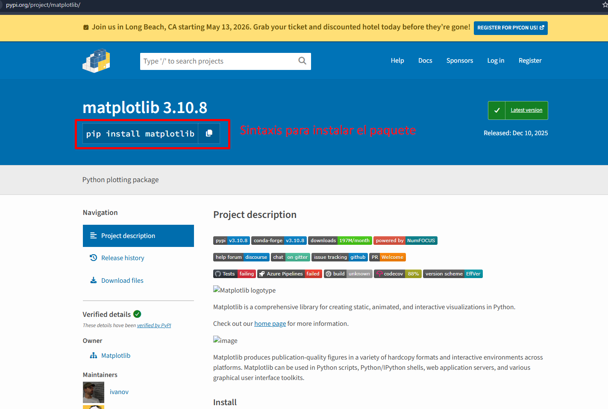
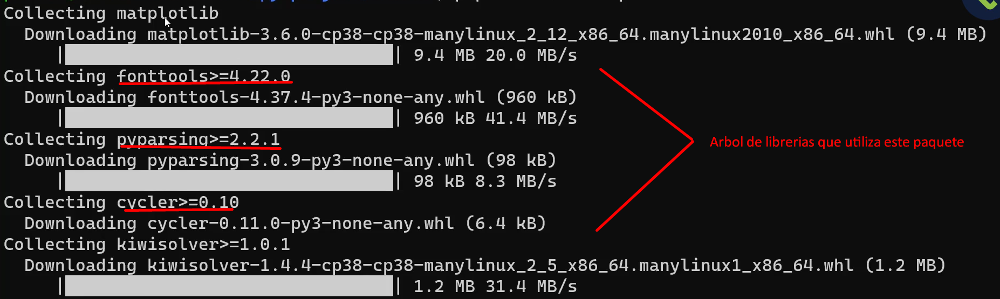

## 🐧 Instalar Pip y paquetes escensiales

### 1. Instalación de Python

```bash
sudo apt install python3
```

### 2. Instalación de Pip

Abrir la terminal y ejecuta:

```bash
sudo apt install -y python3-pip
```

\*Si tienes instalado anaconda puedes omitir este paso ya que por defecto este paquete estará en tu entorno base.

📌 Consejo práctico:

- Prioriza conda install porque asegura compatibilidad con el ecosistema de Anaconda (dependencias, librerías científicas).
- Usa pip install solo cuando el paquete no exista en conda.

### 3. Instalación de paquetes escenciales para compilar Pip

Abrir la terminal y ejecuta:

```bash
sudo apt install -y build-essential libssl-dev libffi-dev python3-dev
```

\*Estos paquetes son como los “cimientos” del sistema para compilar software, y se instalan a nivel global en Linux, no dentro de Anaconda.

### 4. ¿Donde encontrar los paquetes?

Para buscar los paquetes ingresa a:

[Paquetes](https://pypi.org/)

Luego escribe el paquete que necesitas utilizar

Ejemplo:


Finalmente ejecuta el comando indicado en tu terminal



Al instalar verás el árbol de dependencias de este paquete, un paquete puede usar otros paquetes



### 5. Práctica

- Crear archivo paquete_matplotlib.py
- Crear archivo main.py para ejecutar el código

En la terminal asegurate de estar en la carpeta que contiene los scripts en este caso la ruta seria `~/ia-datascience/01-fundamentos/03-pip-entornos-virtuales` una vez situado allí, ejecuta:

```bash
python3 main.py
```

\*Ver archivos de práctica.
