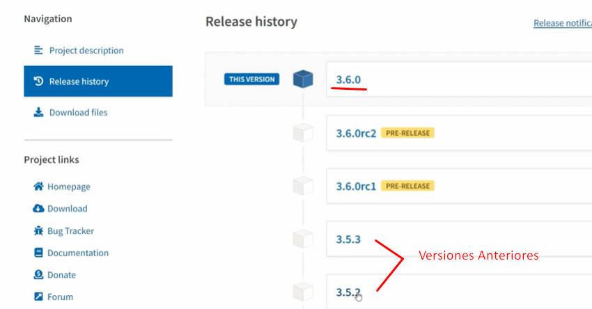

## 🐧 Ambientes virtuales

### 1. Administración de paquetes

Los ambientes virtuales en python encapsulan cada uno de los módulos y lo atan a cada proyecto, no lo dejan en una zona compartida. Esto quiere decir que cada proyecto puede tener sus propias dependencias y en sus propias versionas para no tener conflictas unas con otras.


En la imagen anterior verás que lo único que se comparte es python3 cada ambiente está encapsulado de acuerdo a sus modulos de forma independiente.

Ejemplo:

Al buscar un paquete encontrará la versión estable o actual, sin embargo tambiém podrás ver que en su historia hay diferentes versiones. Un proyecto puede estar usando una de estas versiones por lo que si no se tiene presente que versión es la que maneja cierto proyecto puede causar conflictos ya que el proyecto puede requerir esta versión en específico.



Para listar los paquetes instalados en un proyecto ejecuta:

```bash
pip list
```

Allí podrás ver cada paquete con su versión.

### 2. Instalación de paquetes con pip

Para instalar un paquete con pip en una versión específica ejecuta:

```bash
pip install paquete==3.0.1
```

\*Ten presente que el proceso de instalación reemplazará la versión del paquete que tengas instalado, de ahí la importancia de encapsular cada ambiente por modulo.

### 3. Usando enrtornos virtuales

#### 3.1. Identificar binarios

Lo primero que se debe realizar es validar desde donde se está ejecutando pyhton y pip. Para ello ejecuta:

```bash
which python3
```

```bash
which pip
```

Notarás la ruta desde donde se está ejecutando cada uno de ellos, ejemplo: /home/usuario/bin/python3 o /home/usuario/anaconda3/bin/python3

#### 3.1. Instalar Venv

Si tienes instalado anaconda no requieres nueva instalación en caso contario para instalar venv ejecuta:

```bash
sudo apt install -y python3-venv
```

\*Puedes saber de donde proviene un paquete usando: Ejemplo con Venv -> `python -c "import venv; print(venv.__file__)"`

#### 3.2. Crear ambientes con Venv

Antes de crear cada ambiente es importante que ingreses a cada modulo (carpeta)
